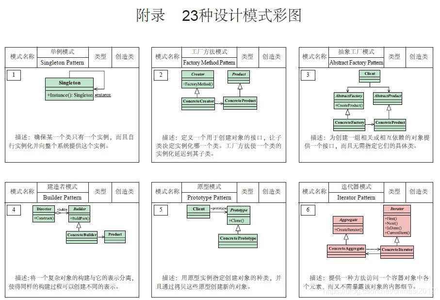
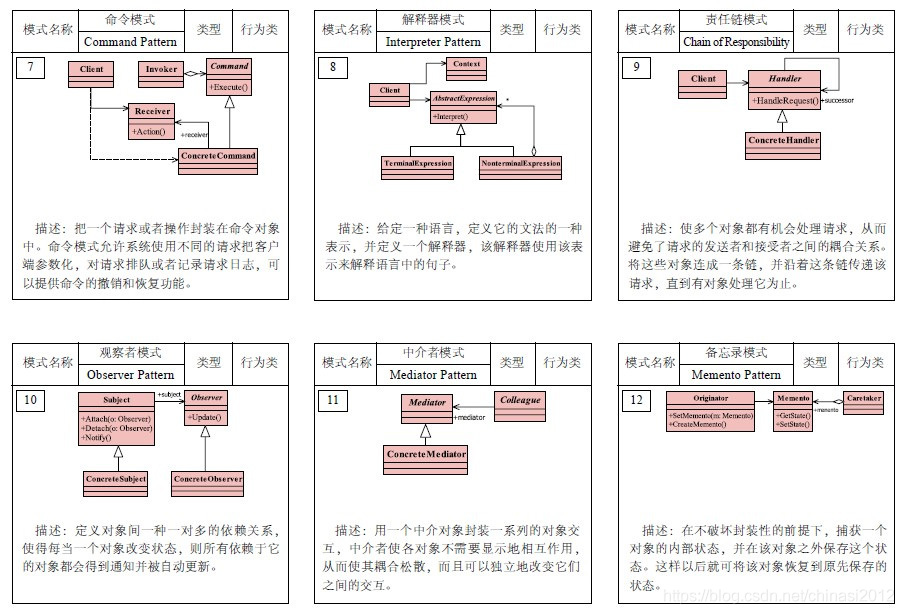
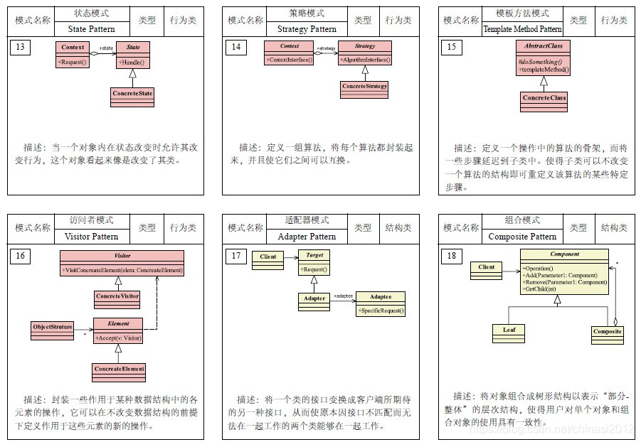
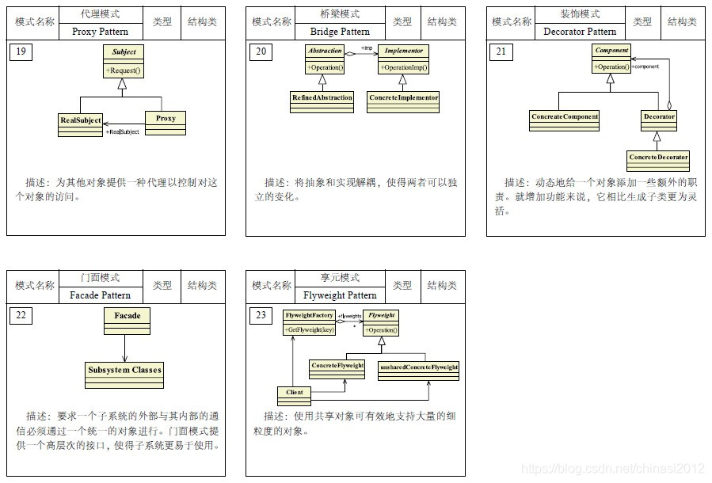

# 23种设计模式
## 创建型模式（Creational Patterns ）
  *关注于对象的创建，同时隐藏创建逻辑*
  1. 工厂模式
  2. 抽象模式
  3. 单例模式
  4. 建造者模式
  5. 原型模式
## 结构型模式（ Structural Patterns ）
  *关注于类和对象之间的组合*
  1. 适配者模式
  2. 过滤器模式
  3. 装饰者模式
  4. 享元模式
  5. 代理模式
  6. 外观模式
  7. 组合模式
  8. 桥接模式
## 行为型模式（ Behavioral Patterns ）
  *关注于对象之间的通讯*
  1. 责任链模式
  2. 命令模式
  3. 中介者模式
  4. 观察者模式
  5. 状态模式
  6. 策略模式
  7. 模板模式
  8. 空对象模式
  9. 备忘录模式
  10. 迭代器模式
  11. 解释器模式
  12. 访问者模式
   
# 设计模式的六大原则
1. **开闭原则（Open Close Principle）**
   
  开闭原则就是说对扩展开放，对修改关闭。在程序需要进行扩展的时候，不能去修改原有代码，实现一个热插拔的效果。
  所以一句话概括就是：为了使程序的扩展性好，易于维护和升级。想要达到这样的效果，我们需要使用接口和抽象类，后面的具体设计中我们会体会到这点

2. **里氏代换原则（Liskov Substitution Principle）LSP**
   
  面向对象设计的基本原则之一。里氏代换原则中说，任何基类可以出现的地方，子类一定可以出现。

  LSP是继承复用的基石，只有当衍生类可以替换掉基类，软件单位的功能不受影响时，基类才能真正被复用，而衍生类也能够在基类的基础上增加新的行为。
  里氏代换原则是对“开-闭”原则的补充。实现“开-闭”原则的关键步骤就是抽象化。

  而基类与子类的继承关系就是抽象化的具体体现，所以里氏代换原则是对实现抽象化的具体步骤的规范。

3. **依赖倒转原则（Dependence Inversion Principle）**
   
这个是开闭原则的基础，具体内容：针对接口编程，依赖于抽象而不依赖于具体。

4. **接口隔离原则（Interface Segregation Principle）**
   
这个原则的意思是：使用多个隔离的接口，比使用单个接口要好。还是一个降低类之间的耦合度的意思，从这个我们看出，其实设计模式就是一个软件的设计思想，
从大型软件架构出发，为了升级和维护方便，要降低依赖，降低耦合

5. **迪米特法则（最少知道原则）（Demeter Principle）**
   
为什么叫最少知道原则，就是说：一个实体应当尽量少的与其他实体之间发生相互作用，使得系统功能模块相对独立

6. **合成复用原则（Composite Reuse Principle）**
   
原则是尽量使用合成、聚合的方式，而不是使用继承。

