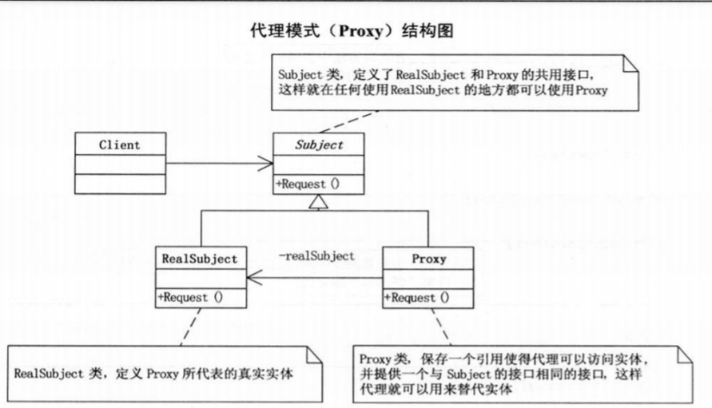
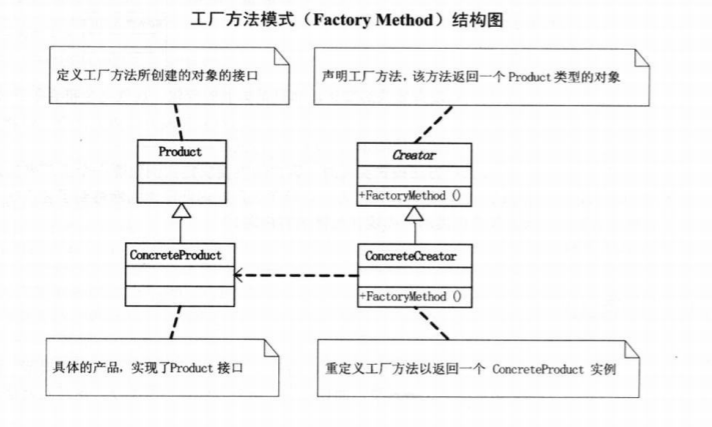

# 简单工厂

# 策略模式
    策略模式是一种定义一系列算法的方法，完成相同的工作，实现不同，以相同的方式调用所有的算法，减少各种算法类与使用算法类之间的耦合[DPE]

# 单一职责原则（SRP）
    就一个类而言，应该仅有一个引起它变化的原因[ASD]
    如果一个类承担的职责过多，就等于把这些职责耦合在一起，当一个职责的变卦可能会削弱或者抑制这个类完成其他职责的能力
    
# 开放封闭原则
    软件实体（类，模块，函数等等）可以拓展，但是不可以修改。
    开放-封闭原则是面向对象设计的核心。

# 依赖倒转原则
    面向对象：可维护，可扩展，可复用，灵活性好
    依赖倒转，又叫依赖倒置：抽象不应该依赖细节，细节应该依赖于抽象，即针对接口编程。

    原则：
    A. 高层模块不应该依赖低层模块，两个都应该依赖抽象
    B. 抽象不应该依赖细节，细节应该依赖抽象

# 装饰模式（Decorator）
    动态的给一个对象添加一些额外的职责，就增加功能来说，装饰者比生成子类更加灵活

# 代理模式(Proxy)
    为其他对象提供一只代理以控制对这个对象的访问
 
## 应用
    1. 远程代理
        为一个对象在不同的地址空间提供局部代表，这样可以隐藏一个对象存在于不同地址空间的事实
        如：WebService 利用WebReference代理进行远程访问的问题
    2. 虚拟代理
        根据需求需要创建开销很大的对象，通过它来存放实例化需要很长时间的真实对象
        如：Html文字和图片
    3. 安全代理
        控制真实对象的访问权限
    4. 智能指引
        调用真实的对象时，代理处理另外一些事
# 工厂模式

    简单工厂的最大优点在于工厂类中间包含了必要的逻辑判断，根据客户端的选择条件动态实例化相关的类，对于客户端来说，去除了与具体产品的依赖。
    但是修改是需要加case,修改原来的类，违背开放-封闭原则

  **工厂模式**
  
    定义一个创建对象的接口，让子类决定实例化哪一个类，工厂方法使一个类的实例化延迟到其子类

# 原型模式
    用原型实例指定创建对象的种类，并且通过拷贝这些原型创建新的对象
    原型模式其实就是从一个对象再创建另外一个可定制的对象，而且不需要知道任何创建的细节

# 模板模式
    定义一个操作中的算法骨架，而将一些步骤延迟到子类中，模板方法使得子类可以不改变一个算法的结构即可重定义该算法的某些特殊步骤
    通过吧不变的行为搬移到超类，去除子类中的重复代码来体现它的优势

# 迪米特法则
    也称最少知识原则
    如果两个类不必彼此直接通信，那么这两个类就不应当发生直接的相互的作用。如果其中一个类需要调用另一个类的某一个方法的话，可以通过第三者转发调用

# 外观模式
    为子系统中的一组接口提供一个一致的界面，此模式定义了一个高层的接口，这个接口使得这一子系统更加容易使用
## 如何使用
    1. 设计初期，应该要有意识的将不同的两个层分离，层与层之间建立外观
    2. 开发阶段，子系统往往因为不断的重构演化而变得越来越复杂，增加外观可以提供一个简单的接口减少它们之间的的依赖
    3. 维护大型系统，提供设计粗糙或者高度复杂的遗留代码的比较清晰简单的接口

# 建造者模式
    将一个复杂对象的构建与它的表示分离，是都同样的构建过程可以创建不同的表示

# 观察者模式
    定义了一种一对多的依赖关系，让多个观察者对象同时监听一个主题的对象，这个主题对象再状态发生变化时，会通知所有观察者对象，使它们能够自己更新自己
## 特点
    当一个对象的改变需要同时改变其他对象，而且不知道具体有多少对象有待改变的时，使用此模式
    观察者模式所做的工作其实就是在解除耦合，让耦合的双方都依赖于抽象，而不是依赖于具体，从而使各自的变化都不会影响另一边的变化
**事件委托**可以很好的完善观察者模式中，观察者和同志者解耦的问题

# 抽象工厂模式
    提供一个创建一系列相关或者相互依赖的对象接口，而无需指定它们具体的类
## 反射+ 配置文件访问数据库

# 状态模式
    当一个对象的内在状态改变时，允许改变其行为，这个对象看起来像是改变了其类
    主要解决的是当控制一个对象状态转换的条件表达式过于复杂的情况，把状态的判断逻辑转移到表示不同状态的一系列类当中，可以把复杂的逻辑简单化

# 适配器模式
    将一个类的接口转换为客户希望的另外一个接口，Adapter模式使得原来由于接口不兼容而不能一起工作的那些类可以一起工作
    两个类所做的事情相同或者相似，但是具有不同的接口时。

# 备忘录模式
    在不破坏封装的前提下，捕获一个对象的内部状态，并在该对象之外保存这个状态，这样之后就可将这个对象恢复到原先保存的状态
    适用于功能比较复杂的，但需要维护或者记录属性历史的类，或者需要保存的属性只是众多属性中的一部分

# 组合模式
    将对象组合成树形结构以表示‘部分-整体’的层次结构，组合模式使得用户对单个对象和组合对象的使用具有一致性
    当需求中是体现部分与整体层次的结构时，以及你希望用户可以忽略组合对象与单个对象的不同，统一的使用组合结构中的所有对象

