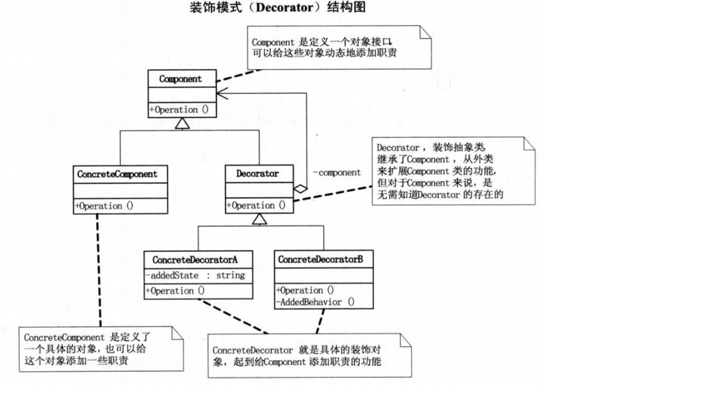

# 简单工厂

# 策略模式
    策略模式是一种定义一系列算法的方法，完成相同的工作，实现不同，以相同的方式调用所有的算法，减少各种算法类与使用算法类之间的耦合[DPE]

# 单一职责原则（SRP）
    就一个类而言，应该仅有一个引起它变化的原因[ASD]
    如果一个类承担的职责过多，就等于把这些职责耦合在一起，当一个职责的变卦可能会削弱或者抑制这个类完成其他职责的能力
    
# 开放封闭原则
    软件实体（类，模块，函数等等）可以拓展，但是不可以修改。
    开放-封闭原则是面向对象设计的核心。

# 依赖倒转原则
    面向对象：可维护，可扩展，可复用，灵活性好
    依赖倒转，又叫依赖倒置：抽象不应该依赖细节，细节应该依赖于抽象，即针对接口编程。

    原则：
    A. 高层模块不应该依赖低层模块，两个都应该依赖抽象
    B. 抽象不应该依赖细节，细节应该依赖抽象

# 装饰模式（Decorator）
    动态的给一个对象添加一些额外的职责，就增加功能来说，装饰者比生成子类更加灵活

# 代理模式(Proxy)
    为其他对象提供一只代理以控制对这个对象的访问
 
## 应用
    1. 远程代理
        为一个对象在不同的地址空间提供局部代表，这样可以隐藏一个对象存在于不同地址空间的事实
        如：webservice 利用WebReferce代理进行远程访问的问题
    2. 虚拟代理
        根据需求需要创建开销很大的对象，通过它来存放实例化需要很长时间的真实对象
        如：Html文字和图片
    3. 安全代理
        控制真实对象的访问权限
    4. 智能指引
        调用真实的对象时，代理处理另外一些事
# 工厂模式

    简单工厂的最大优点在于工厂类中间包含了必要的逻辑判断，根据客户端的选择条件动态实例化相关的类，对于客户端来说，去除了与具体产品的依赖。
    但是修改是需要加case,修改原来的类，违背开放-封闭原则

  **工厂模式**
  
    定义一个创建对象的接口，让子类决定实例化哪一个类，工厂方法使一个类的实例化延迟到其子类

    